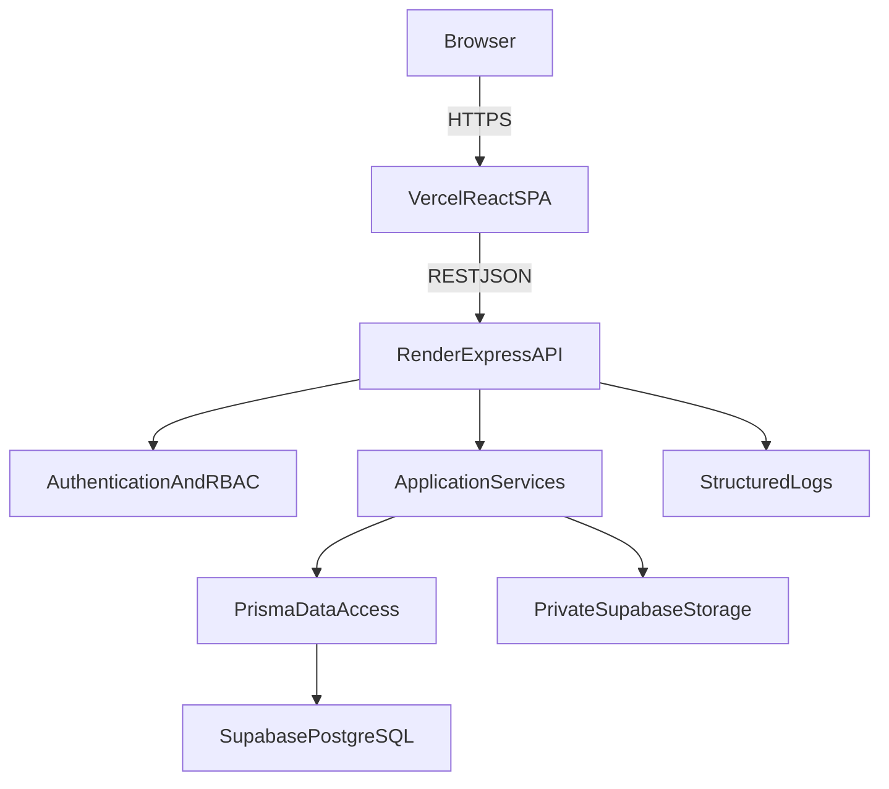
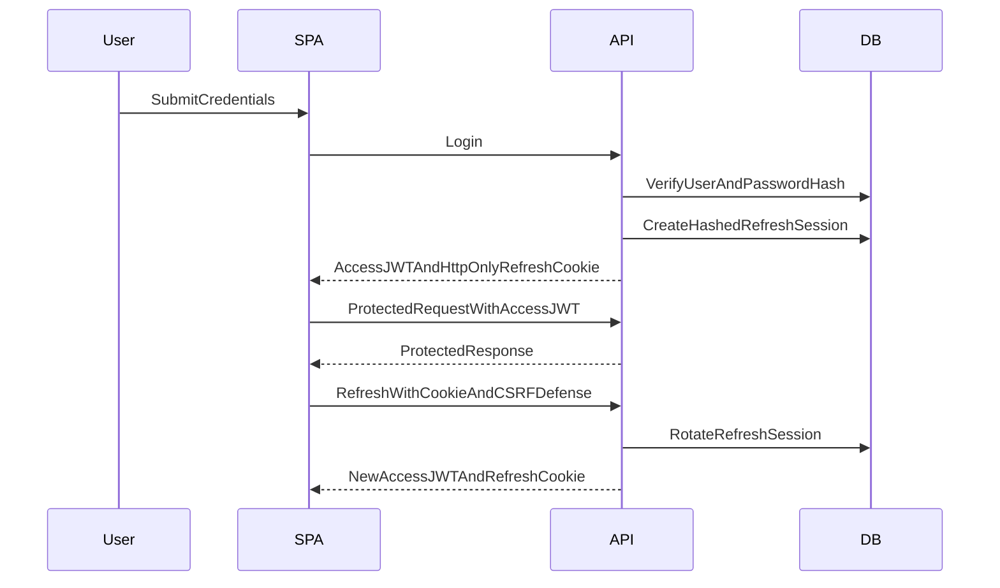
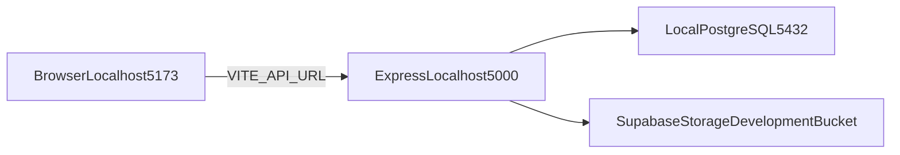

# System Architecture

Status: Approved design; Milestone 4 core application infrastructure implemented,
authentication and business modules remain planned

## Implemented core infrastructure

- Zod-validated, environment-specific backend configuration with narrow CORS and
  structured, redacted logging.
- Central Prisma client lifecycle, testable Express creation, database-aware startup,
  and graceful HTTP/database shutdown.
- Versioned REST routing, request IDs, safe centralized errors, validation field
  details, bounded pagination/sorting utilities, and implemented-contract OpenAPI.
- Authentication-ready current-user and access-control extension points. Token
  verification, sessions, login, and authorization rules are not implemented.
- Frontend routing, application shell, reusable page/loading/error/empty states,
  notifications, and a typed central API client.

## Architectural goals

- Keep requirements traceable and modules independently understandable.
- Enforce authentication, authorization, validation, and audit at the backend.
- Support local and cloud environments through configuration.
- Keep business rules outside HTTP controllers and UI components.
- Make critical business operations transactional and testable.
- Prefer a simple modular monolith over distributed services.

## Runtime context



React never connects to PostgreSQL or Supabase service credentials directly. The Express
API is the policy and data-access boundary.

## Backend layers

### Presentation/API

- Express routes, middleware, and controllers.
- Parses HTTP concerns and maps validated data to application commands/queries.
- Returns stable HTTP status codes and response/error contracts.
- Contains no direct Prisma queries or substantial business logic.

### Application

- Implements use cases.
- Coordinates domain policies, repositories, external storage, audit events, and
  database transactions.
- Defines transaction boundaries around multi-write operations.

### Domain policies

- Encapsulates permission and business decisions such as valid state transitions,
  appointment conflicts, stock availability, payment limits, and calculated totals.
- Remains independent of Express request/response objects.

### Data access and infrastructure

- Focused repositories use Prisma.
- Infrastructure adapters provide password hashing, token handling, configuration,
  structured logging, and Supabase Storage access.
- Raw SQL is permitted only for a measured query need Prisma cannot express suitably,
  with a documented reason and tests.

## Backend module boundaries

Planned modules are `auth`, `users`, `organization`, `patients`, `doctors`,
`appointments`, `admissions`, `medical-records`, `laboratory`, `pharmacy`, `billing`,
`staff`, `reports`, and `audit`.

Each module should own its routes, schemas, controllers, services, policies, and
repositories. Cross-module work goes through application interfaces rather than
importing another module's persistence details.

## Frontend architecture

The React application is organized by the same user-facing features plus shared
infrastructure:

- `app`: routing, providers, theme, and application shell.
- `features`: auth, patients, appointments, admissions, medical records, laboratory,
  pharmacy, billing, staff, reports, and dashboard.
- `shared`: reusable controls, tables, forms, dialogs, notifications, and state views.
- `api`: central REST client, API types, error mapping, and authentication refresh.

Key rules:

- `VITE_API_URL` provides the API location.
- Server data uses the central API client. Selection of a focused query/cache layer is
  deferred until the first business-data module, when its query lifecycle requirements
  can be evaluated without adding an unnecessary dependency.
- The access token remains in memory.
- Route guards and permission-aware controls improve usability but do not authorize
  operations.
- UI components do not contain database or material business rules.
- Loading, failure, empty, validation, and success states are intentional and
  consistent.

## API architecture

- Version routes under `/api/v1`.
- Use plural resource names, appropriate HTTP methods, and standard status codes.
- Validate bodies, route parameters, and query strings with Zod before use.
- Paginate collection endpoints and bound report/date queries.
- Return a stable error contract:

```json
{
  "error": {
    "code": "STABLE_MACHINE_CODE",
    "message": "Safe user-facing message",
    "requestId": "correlation-id",
    "fields": []
  }
}
```

- `fields` is present only for field-level validation issues.
- Do not expose stack traces, Prisma errors, SQL, tokens, or sensitive records.
- Generate or maintain OpenAPI from implemented contracts only.
- Consider idempotency controls for retry-sensitive payment and dispensing commands.

Planned route families mirror the approved modules. Their presence here is an
architecture boundary, not documentation of implemented endpoints.

## Authentication flow



- Passwords use Argon2id unless implementation benchmarking identifies a documented
  constraint.
- Access JWTs are short-lived.
- Refresh tokens rotate and only their hashes are persisted.
- Refresh sessions have idle and absolute expiry and are revoked on logout/password
  reset.
- Backend permission and resource checks run for every protected use case.

## Local architecture



Ports are defaults expressed through environment configuration, not application-wide
literals. A dedicated non-production storage bucket preserves cloud behavior locally.
Automated tests may use a storage test double without presenting it as implemented
production storage.

## Data and transaction boundaries

Prisma is the normal database interface. Transactions are applied where related writes
must succeed or fail together, including:

- payment recording and invoice balance/status update;
- prescription dispensing, batch allocation, and stock movement creation;
- invoice creation with line items;
- result finalization plus required audit event where consistency demands it.

Long external object-storage operations must not hold database transactions open.
Document upload uses a staged flow so object and metadata failures can be reconciled.

## Reporting

Reports and dashboards are read models over operational data. Initial implementations
use indexed aggregate queries with bounded filters. Materialized views, replicas, or a
warehouse require measured evidence and are not part of the baseline.

## Observability

- Structured logs include timestamp, severity, service, environment, request ID, route,
  status, and duration.
- Audit events are durable domain/security history and are separate from operational
  logs.
- Health endpoints distinguish process liveness from dependency readiness.
- Metrics and external monitoring are selected during deployment preparation.
- Protected health information, credentials, tokens, and document contents are excluded
  from logs.

## Quality gates

Each implementation milestone must pass relevant linting, type checks, unit/integration
tests, production builds, changed-file review, security review, and documentation
updates. No code is considered deployed merely because architecture documentation
exists.
