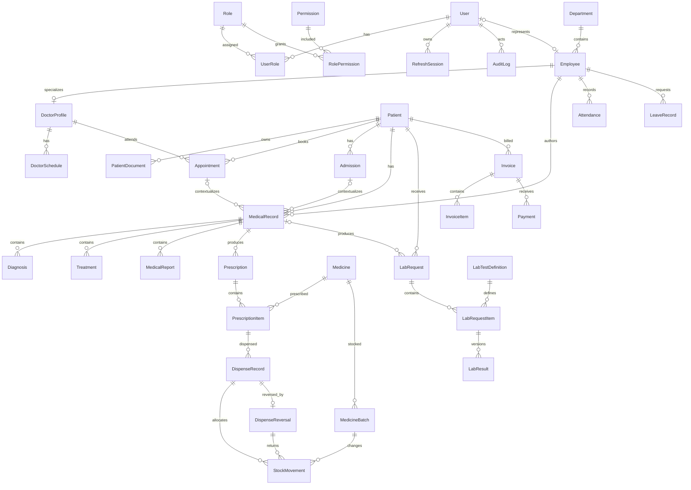

# Logical Data Model

Status: Approved logical design; implemented by the Milestone 3 Prisma schema and
initial migration

## Design principles

- PostgreSQL is the relational source of truth; Prisma is the normal access layer.
- Use UUID primary keys and separate human-readable business identifiers.
- Store timestamps in UTC and calculate local dates using configured hospital timezone.
- Store money as fixed-precision decimals plus ISO currency.
- Preserve clinical, inventory, audit, and financial history.
- Add only entities justified by requirements or transaction integrity.
- Keep reports/dashboard as queries over operational data until measured performance
  requires another read model.

Fields below are logical. Exact Prisma/PostgreSQL types, lengths, defaults, and check
constraints are finalized in `physical-database-design.md`.

## Milestone 2 approved refinements

Project-owner decisions D-012 through D-020 resolve several provisional parts of this
model:

- patient birth date supports exact/month/year/unknown precision and the approved
  nullable sex-at-registration values;
- active doctor and patient appointment overlaps are prohibited;
- diagnoses, treatments, and medical reports are normalized child entities of a
  medical-record container;
- laboratory results are append-oriented versions rather than mutable result columns on
  request items;
- each medicine uses one canonical inventory unit;
- completed dispenses are reversed only through one linked full-quantity reversal and
  mirrored append-only batch return movements;
- partial payments and linked reversals are supported while overpayments are rejected;
- physical money columns use `numeric(19,4)`; and
- the baseline workflow statuses and staff workflow structure are approved.

The unresolved policy details remain listed in the physical design.

## Conceptual ERD

## Common conventions

Most mutable entities include:

- `id` — UUID primary key.
- `createdAt` — required UTC timestamp.
- `updatedAt` — required UTC timestamp.

Historical event entities such as audit logs and stock movements are append-oriented and
do not require a general-purpose `updatedAt`.

Human-readable numbers (`patientNumber`, `employeeNumber`, `invoiceNumber`) are required
and unique but are not primary keys. Their formatting/sequence policy remains a
module-level decision.

## Access and security entities

### User

- `id` — primary key.
- `username` — required, normalized, unique.
- `passwordHash` — required; never returned.
- `status` — required: pending/active/locked/disabled baseline.
- `passwordChangedAt` — required.
- `lastLoginAt` — optional.
- `failedLoginCount`, `lockedUntil` — security state.
- timestamps.

The user is an authentication identity, not a patient. A user may optionally link
one-to-one to an employee.

### Role

- `id`.
- `code` — required, stable, unique.
- `name` — required, unique.
- `description` — optional.
- `isSystem` — protects baseline roles from accidental deletion.
- timestamps/status.

### Permission

- `id`.
- `code` — required, stable, unique, for example `patient.read`.
- `description` — required.

### UserRole

- composite uniqueness on `userId` and `roleId`.
- `userId`, `roleId` — required foreign keys.
- `assignedByUserId`, `assignedAt` — attribution.

### RolePermission

- composite uniqueness on `roleId` and `permissionId`.
- `roleId`, `permissionId` — required foreign keys.

### RefreshSession

- `id`, `userId`.
- `tokenHash` — required and unique; raw token is never stored.
- `expiresAt`, `idleExpiresAt`, `lastUsedAt`.
- `revokedAt`, `revokeReason`, `replacedBySessionId` — optional lifecycle data.
- `createdAt`; optional bounded client metadata such as user-agent hash.

### AuditLog

- `id`, `occurredAt`.
- `actorUserId` — optional only for anonymous/system events.
- `action`, `resourceType`, `resourceId`, `outcome`.
- `requestId` — correlation identifier.
- `metadata` — minimal structured JSON without secrets or unnecessary health data.
- `sourceIp` — optional and subject to privacy/retention policy.

Audit rows are append-only for application roles.

## Organization and staff entities

### Department

- `id`.
- `code` — required and unique.
- `name` — required and unique.
- `description` — optional.
- `status` — active/inactive.
- timestamps.

### Employee

- `id`.
- `employeeNumber` — required and unique.
- `userId` — optional and unique; an employee need not have application access.
- `departmentId` — required under the baseline; changes preserve history through audit.
- `firstName`, `lastName` — required.
- contact fields — optional and minimized.
- `jobTitle` — required.
- `employmentStatus`, `hireDate`, optional `endDate`.
- timestamps.

### DoctorProfile

- `id`.
- `employeeId` — required and unique.
- `licenseNumber` — required and unique.
- `specialization` — required.
- optional professional summary/contact extension.
- `status`.
- timestamps.

A doctor is modeled as an employee specialization rather than duplicating employee and
department data.

### DoctorSchedule

- `id`, `doctorId`.
- `startsAt`, `endsAt` — required UTC interval.
- `status` — available/unavailable/cancelled baseline.
- optional `note`.
- timestamps.

Concrete intervals avoid committing to unspecified recurrence rules. Recurrence may be
added later after schedule policy is clarified.

### Attendance

- `id`, `employeeId`.
- `workDate` — hospital-local date.
- optional `checkInAt`, `checkOutAt`.
- `status` — present/absent/leave.
- optional `note`, `recordedByUserId`.
- timestamps.
- unique employee/work-date row under the baseline.

### LeaveRecord

- `id`, `employeeId`.
- `startsOn`, `endsOn`.
- `leaveType`, `reason`.
- `status` — requested/approved/rejected/cancelled.
- optional `decidedByUserId`, `decidedAt`, `decisionNote`.
- timestamps.

Decision actor/time metadata is approved. Leave types, allowances, overlap rules, and
capture/approval operating policy remain unresolved.

## Patient and care entities

### Patient

The PDF does not specify demographic fields. The approved minimum registration set is:

- `id`.
- `patientNumber` — required and unique.
- `firstName`, `lastName` — required.
- optional `dateOfBirth` plus required precision:
  exact/month/year/unknown.
- optional sex at registration: female/male/intersex/unknown/not-disclosed.
- optional phone, email, address, emergency contact.
- `status` — active/inactive/deceased.
- timestamps.

National identifiers, insurance, portal credentials, consent, and extensive demographic
data are not assumed.

### PatientDocument

- `id`, `patientId`, `uploadedByUserId`.
- `objectKey` — required and unique; generated by the system.
- `originalName`, `detectedMediaType`, `sizeBytes`, `checksum`.
- `category` — approved document category.
- `status` — pending/available/quarantined/deleted baseline.
- optional `description`, `uploadedAt`, `deletedAt`.
- timestamps.

Object bytes remain in private Supabase Storage.

### Appointment

- `id`, `patientId`, `doctorId`.
- `startsAt`, `endsAt`.
- `status` — scheduled/checked-in/completed/cancelled/no-show.
- optional `reason`, `cancellationReason`, `cancelledAt`, `cancelledByUserId`.
- `rescheduledFromAppointmentId` — optional self-reference; replacement preserves
  scheduling history.
- `createdByUserId`.
- timestamps.

The physical design prevents active overlaps for both a doctor and a patient.

### Admission

- `id`, `patientId`.
- `admissionNumber` — required and unique.
- optional `attendingDoctorId`.
- `admittedAt`, optional `dischargedAt`.
- `status` — admitted/discharged/cancelled.
- `reason`; optional discharge summary.
- `createdByUserId`.
- timestamps.

No bed, ward, room, transfer, or occupancy model is included.

### MedicalRecord

- `id`, `patientId`, `authorEmployeeId`.
- optional `appointmentId` or `admissionId`; at most one care context under the
  baseline.
- `occurredAt`.
- `status` — draft/final/amended baseline.
- optional `finalizedAt`, `amendsRecordId`.
- timestamps.

The record is a clinical container. Separate diagnosis, treatment, and medical-report
children avoid broad nullable content columns. Structured diagnosis coding is deferred
because no coding system is specified. Amendments create traceable records rather than
overwriting finalized clinical history.

### Diagnosis

- `id`, `medicalRecordId`.
- required diagnosis text.
- creation timestamp.

### Treatment

- `id`, `medicalRecordId`.
- required treatment text.
- creation timestamp.

### MedicalReport

- `id`, `medicalRecordId`.
- required title and report text.
- creation timestamp.

### Prescription

- `id`, `medicalRecordId`, `patientId`, `prescribedByDoctorId`.
- `prescribedAt`.
- `status` — active/partially-dispensed/dispensed/cancelled/expired baseline.
- optional `notes`.
- timestamps.

`patientId` is retained for safe direct scoping but must agree with the medical record;
the application transaction enforces consistency.

### PrescriptionItem

- `id`, `prescriptionId`, `medicineId`.
- dosage, route, frequency, duration, instructions.
- `quantityPrescribed` and unit.
- timestamps.

Final medication units and validation rules require pharmacy policy.

## Laboratory entities

### LabTestDefinition

- `id`.
- `code`, `name` — required and unique as appropriate.
- optional specimen type, default unit, reference-range description.
- `price` — optional fixed-precision charge snapshot source.
- `status`.
- timestamps.

### LabRequest

- `id`, `patientId`, `requestedByDoctorId`.
- optional `medicalRecordId`.
- `requestedAt`.
- `status` — requested/sample-collected/in-progress/completed/cancelled baseline.
- optional clinical note.
- timestamps.

### LabRequestItem

- `id`, `labRequestId`, `testDefinitionId`.
- `status`.
- optional `sampleCollectedAt`, `sampleCollectedByEmployeeId`.
- `priceSnapshot` and currency when billable.
- timestamps.

### LabResult

- `id`, `labRequestItemId`, version number.
- result value and optional unit/reference-range/note snapshots.
- entering employee/time and optional finalizing employee/time.
- optional `supersedesLabResultId`.

Finalized results are immutable. Corrections append and link a new version.

## Pharmacy entities

### Medicine

- `id`.
- `code` — required and unique.
- generic/brand name fields as approved.
- dosage form, strength, inventory unit.
- default sale price and currency.
- low-stock threshold.
- `status`.
- timestamps.

### MedicineBatch

- `id`, `medicineId`.
- `batchNumber`.
- `expiryDate`.
- received quantity, unit cost, sale price snapshot.
- `receivedAt`.
- `status`.
- timestamps.
- unique batch number per medicine.

Current quantity is derived from stock movements rather than independently edited.
All inventory, movement, prescribed-quantity, and dispense quantities use the
medicine's canonical inventory unit; conversions are outside current scope.

### StockMovement

- `id`, `medicineBatchId`.
- `movementType` — receipt/dispense/adjustment/return/disposal baseline.
- signed `quantity`.
- optional `dispenseRecordId` for a normal dispense allocation.
- optional `dispenseReversalId` for a reversal return allocation.
- `occurredAt`, `performedByUserId`.
- `reason`, optional external/reference identifier.

Rows are append-only. A normal dispense has negative `dispense` movements; its full
reversal has positive `return` movements linked to the reversal record and exactly
mirrors the original medicine-batch quantities.

### DispenseRecord

- `id`, `prescriptionItemId`.
- `quantityDispensed`, unit.
- `dispensedAt`, `dispensedByEmployeeId`.
- `status` — `completed`.
- optional note.
- timestamps.

A dispense may allocate stock from multiple batches through its associated stock
movements. It remains unchanged if reversed.

### DispenseReversal

- `id`, `dispenseRecordId` (unique).
- `quantityReversed`.
- required `reason`.
- `reversedByUserId`, `reversedAt`, `createdAt`.

Only one full reversal may exist per completed dispense. Its quantity equals the
original quantity, and its return movements mirror every original batch allocation.
These cross-row invariants are enforced in the locked reversal transaction.

## Billing entities

### Invoice

- `id`, `patientId`.
- `invoiceNumber` — required and unique.
- `issuedAt`, optional `dueAt`.
- `currency`.
- subtotal, discount, tax, total, amountPaid, balance — fixed precision.
- `status` — draft/issued/partially-paid/paid/void baseline.
- `createdByUserId`.
- timestamps.

Discount and tax behavior is structurally supported but is not enabled as business
functionality until clarified.

### InvoiceItem

- `id`, `invoiceId`.
- `category` — consultation/laboratory/pharmacy/admission.
- description snapshot.
- quantity, unit price, line total.
- exactly one optional source reference as applicable: `appointmentId`,
  `labRequestItemId`, `dispenseRecordId`, or `admissionId`.
- timestamps.

Each line has exactly one source reference. A reviewed billing idempotency policy
prevents accidental duplicate charging without assuming that a broad source such as an
admission can produce only one charge. Prices are snapshots so later catalog price
changes do not alter an issued invoice.

### Payment

- `id`, `invoiceId`.
- `paymentNumber` — required and unique.
- amount and currency.
- `method`, optional external reference.
- `status` — recorded/void/reversed baseline.
- `paidAt`, `receivedByUserId`.
- optional `reversesPaymentId`, note.
- timestamps.

Partial payments are supported, overpayments are rejected, and payment reversals use
linked records. Refunds beyond reversal remain outside current scope.

## Relationships and cardinality rules

- User-to-role and role-to-permission are many-to-many through explicit join entities.
- User-to-employee and employee-to-doctor profile are optional one-to-one.
- Department-to-employee is one-to-many.
- Patient-to-appointment/admission/record/document/invoice is one-to-many.
- Doctor-to-schedule/appointment is one-to-many.
- Medical record may relate to one appointment or one admission, not both, and has
  normalized diagnosis, treatment, and medical-report children.
- Prescription and lab request each belong to one patient and originating clinician.
- Prescription and lab-request creation atomically commits the parent with one or more
  items; neither lifecycle has a draft parent state.
- Lab request items have append-oriented result versions.
- Medicine has many batches; stock movement belongs to one batch.
- Invoice may have zero stored items while draft, requires one or more before issue, and
  has zero or more payments.

## Required constraints

- All business identifiers and security codes are unique.
- Start/end ranges require end after start.
- Quantities and monetary charges are non-negative where appropriate; signed stock
  movement is non-zero.
- Payment and invoice currencies must agree.
- Net payment totals cannot exceed the invoice total.
- Document size must be positive and bounded by configuration.
- Finalized clinical/lab records cannot be destructively edited.
- `dischargedAt` cannot precede `admittedAt`.
- Medicine batches require expiry after valid receiving date according to approved
  pharmacy policy.
- Invoice line total must equal the approved rounded quantity/unit-price calculation.
- Foreign-key deletion defaults to `RESTRICT` for historical/transactional data.
- Master records use inactive status rather than deletion when referenced.

Some cross-row constraints, especially appointment overlaps and stock availability,
require transactions and may use PostgreSQL constraints only after Prisma migration
support is reviewed.

## Index plan

In addition to primary and unique indexes:

- `User(status)` and refresh session `(userId, revokedAt, expiresAt)`.
- `AuditLog(actorUserId, occurredAt)` and `(resourceType, resourceId, occurredAt)`.
- Patient normalized surname/given name and contact search fields; use PostgreSQL text
  indexes only after query behavior is established.
- `Employee(departmentId, employmentStatus)`.
- `DoctorSchedule(doctorId, startsAt, endsAt)`.
- `Appointment(doctorId, startsAt, status)`, `(patientId, startsAt)`, and
  `(status, startsAt)`.
- `Admission(patientId, admittedAt)` and `(status, admittedAt)`.
- `MedicalRecord(patientId, occurredAt)` and author/date.
- `LabRequest(patientId, requestedAt)` and `(status, requestedAt)`;
  `LabRequestItem(status, sampleCollectedAt)`.
- `MedicineBatch(medicineId, expiryDate, status)` and expiry/status for alerts.
- `StockMovement(medicineBatchId, occurredAt)`.
- `Prescription(patientId, prescribedAt, status)`.
- `Invoice(patientId, issuedAt)` and `(status, issuedAt)`.
- `Payment(invoiceId, paidAt, status)`.
- `Attendance(employeeId, workDate)` and `LeaveRecord(employeeId, startsOn, endsOn)`.

Index choices are validated with actual query plans; redundant indexes are removed.

## Transaction boundaries

### Appointment booking/rescheduling

Lock or otherwise serialize the relevant scheduling range, verify doctor availability
and conflicts, create the appointment/replacement, and audit the change atomically.

### Laboratory result finalization

Validate required result data and status, finalize requested items/request, and create
the corresponding audit event atomically where the audit store shares PostgreSQL.

### Prescription dispensing

Lock selected medicine batches, verify non-expired available stock, create the dispense
record and stock movements, update prescription status, create approved invoice lines,
and audit atomically.

### Dispensing reversal

Lock the completed dispense and its original stock movements, reject an existing
reversal, create the full-quantity reversal, append positive return movements that
mirror every original batch allocation, update prescription status from effective
unreversed dispensing, and audit atomically. Do not alter invoice or payment records.

### Invoice creation

Create the invoice and immutable line snapshots together. Validate source ownership and
the approved billing idempotency rule before issue.

### Payment recording

Lock/read the invoice, validate amount/currency/status, create payment, recompute stored
paid/balance/status values, and audit atomically.

### Document upload

Object storage cannot participate in a PostgreSQL transaction. Use a staged metadata
state, upload the object, then mark available. A reconciliation job/process handles
abandoned metadata or orphaned objects.

## Normalization review

- Access joins remove repeating roles and permissions.
- Employee common data is not duplicated in doctor profiles.
- Medicine master data is separated from expiring batches and immutable movements.
- Invoice line price snapshots are intentional historical denormalization.
- Patient IDs repeated on prescriptions/invoices support ownership and query scope but
  must be transactionally consistent with source records.
- Stored invoice totals are intentional performance/audit snapshots and must be computed
  by one trusted service.
- Dashboard/report values are not persisted initially.

The baseline is approximately third normal form except for documented immutable
snapshots and controlled aggregates.

## Physical-schema approval gate

The project owner passed this gate for Milestone 3. The approved physical design is
implemented in `backend/prisma/schema.prisma` and the reviewed initial migration,
including restricted deletes, expression/partial indexes, checks, and PostgreSQL
appointment exclusion constraints. Deferred `PENDING DECISION` items remain outside
the implemented workflow policy.
