# Physical Database ERD

Status: Approved; implemented by the Milestone 3 Prisma schema and initial migration

This Mermaid ERD represents the tables and foreign-key relationships defined in
`physical-database-design.md`. Optional source/context relationships are constrained by
checks described in that document.

```mermaid
erDiagram
  USERS {
    uuid id PK
    varchar username UK
    varchar password_hash
    varchar status
  }
  ROLES {
    uuid id PK
    varchar code UK
    varchar name UK
  }
  PERMISSIONS {
    uuid id PK
    varchar code UK
  }
  USER_ROLES {
    uuid id PK
    uuid user_id FK
    uuid role_id FK
    uuid assigned_by_user_id FK
  }
  ROLE_PERMISSIONS {
    uuid id PK
    uuid role_id FK
    uuid permission_id FK
  }
  REFRESH_SESSIONS {
    uuid id PK
    uuid user_id FK
    varchar token_hash UK
    uuid replaced_by_session_id FK
  }
  AUDIT_LOGS {
    uuid id PK
    uuid actor_user_id FK
    varchar action
    varchar resource_type
    uuid resource_id
  }
  DEPARTMENTS {
    uuid id PK
    varchar code UK
    varchar name UK
  }
  EMPLOYEES {
    uuid id PK
    varchar employee_number UK
    uuid user_id FK,UK
    uuid department_id FK
  }
  DOCTOR_PROFILES {
    uuid id PK
    uuid employee_id FK,UK
    varchar license_number UK
  }
  DOCTOR_SCHEDULES {
    uuid id PK
    uuid doctor_id FK
    timestamptz starts_at
    timestamptz ends_at
  }
  ATTENDANCE_RECORDS {
    uuid id PK
    uuid employee_id FK
    date work_date
    uuid recorded_by_user_id FK
  }
  LEAVE_RECORDS {
    uuid id PK
    uuid employee_id FK
    uuid decided_by_user_id FK
    date starts_on
    date ends_on
  }
  PATIENTS {
    uuid id PK
    varchar patient_number UK
    varchar first_name
    varchar last_name
  }
  PATIENT_DOCUMENTS {
    uuid id PK
    uuid patient_id FK
    uuid uploaded_by_user_id FK
    varchar object_key UK
  }
  APPOINTMENTS {
    uuid id PK
    uuid patient_id FK
    uuid doctor_id FK
    uuid cancelled_by_user_id FK
    uuid rescheduled_from_appointment_id FK,UK
    uuid created_by_user_id FK
  }
  ADMISSIONS {
    uuid id PK
    varchar admission_number UK
    uuid patient_id FK
    uuid attending_doctor_id FK
    uuid created_by_user_id FK
  }
  MEDICAL_RECORDS {
    uuid id PK
    uuid patient_id FK
    uuid author_employee_id FK
    uuid appointment_id FK
    uuid admission_id FK
    uuid amends_medical_record_id FK,UK
  }
  DIAGNOSES {
    uuid id PK
    uuid medical_record_id FK
    text diagnosis_text
  }
  TREATMENTS {
    uuid id PK
    uuid medical_record_id FK
    text treatment_text
  }
  MEDICAL_REPORTS {
    uuid id PK
    uuid medical_record_id FK
    text report_text
  }
  PRESCRIPTIONS {
    uuid id PK
    uuid medical_record_id FK
    uuid patient_id FK
    uuid prescribed_by_doctor_id FK
  }
  PRESCRIPTION_ITEMS {
    uuid id PK
    uuid prescription_id FK
    uuid medicine_id FK
    numeric quantity_prescribed
  }
  LAB_TEST_DEFINITIONS {
    uuid id PK
    varchar code UK
    varchar name UK
  }
  LAB_REQUESTS {
    uuid id PK
    uuid patient_id FK
    uuid requested_by_doctor_id FK
    uuid medical_record_id FK
  }
  LAB_REQUEST_ITEMS {
    uuid id PK
    uuid lab_request_id FK
    uuid test_definition_id FK
    uuid sample_collected_by_employee_id FK
  }
  LAB_RESULTS {
    uuid id PK
    uuid lab_request_item_id FK
    uuid entered_by_employee_id FK
    uuid finalized_by_employee_id FK
    uuid supersedes_lab_result_id FK,UK
    integer version_number
  }
  MEDICINES {
    uuid id PK
    varchar code UK
    varchar inventory_unit
  }
  MEDICINE_BATCHES {
    uuid id PK
    uuid medicine_id FK
    varchar batch_number
    date expiry_date
  }
  DISPENSE_RECORDS {
    uuid id PK
    uuid prescription_item_id FK
    uuid dispensed_by_employee_id FK
  }
  DISPENSE_REVERSALS {
    uuid id PK
    uuid dispense_record_id FK,UK
    uuid reversed_by_user_id FK
    numeric quantity_reversed
  }
  STOCK_MOVEMENTS {
    uuid id PK
    uuid medicine_batch_id FK
    uuid dispense_record_id FK
    uuid dispense_reversal_id FK
    uuid performed_by_user_id FK
    numeric quantity
  }
  INVOICES {
    uuid id PK
    varchar invoice_number UK
    uuid patient_id FK
    uuid created_by_user_id FK
  }
  INVOICE_ITEMS {
    uuid id PK
    uuid invoice_id FK
    uuid appointment_id FK
    uuid lab_request_item_id FK
    uuid dispense_record_id FK
    uuid admission_id FK
  }
  PAYMENTS {
    uuid id PK
    varchar payment_number UK
    uuid invoice_id FK
    uuid received_by_user_id FK
    uuid reverses_payment_id FK,UK
  }

  USERS ||--o{ USER_ROLES : receives
  ROLES ||--o{ USER_ROLES : assigned
  ROLES ||--o{ ROLE_PERMISSIONS : grants
  PERMISSIONS ||--o{ ROLE_PERMISSIONS : includes
  USERS ||--o{ REFRESH_SESSIONS : owns
  REFRESH_SESSIONS o|--o| REFRESH_SESSIONS : replaces
  USERS o|--o{ AUDIT_LOGS : acts_in
  USERS o|--o{ USER_ROLES : assigns

  USERS o|--o| EMPLOYEES : represents
  DEPARTMENTS ||--o{ EMPLOYEES : contains
  EMPLOYEES ||--o| DOCTOR_PROFILES : specializes
  DOCTOR_PROFILES ||--o{ DOCTOR_SCHEDULES : has
  EMPLOYEES ||--o{ ATTENDANCE_RECORDS : records
  USERS o|--o{ ATTENDANCE_RECORDS : enters
  EMPLOYEES ||--o{ LEAVE_RECORDS : requests
  USERS o|--o{ LEAVE_RECORDS : decides

  PATIENTS ||--o{ PATIENT_DOCUMENTS : owns
  USERS ||--o{ PATIENT_DOCUMENTS : uploads
  PATIENTS ||--o{ APPOINTMENTS : books
  DOCTOR_PROFILES ||--o{ APPOINTMENTS : attends
  USERS o|--o{ APPOINTMENTS : cancels
  USERS ||--o{ APPOINTMENTS : creates
  APPOINTMENTS o|--o| APPOINTMENTS : reschedules
  PATIENTS ||--o{ ADMISSIONS : has
  DOCTOR_PROFILES o|--o{ ADMISSIONS : attends
  USERS ||--o{ ADMISSIONS : creates

  PATIENTS ||--o{ MEDICAL_RECORDS : has
  EMPLOYEES ||--o{ MEDICAL_RECORDS : authors
  APPOINTMENTS o|--o{ MEDICAL_RECORDS : contextualizes
  ADMISSIONS o|--o{ MEDICAL_RECORDS : contextualizes
  MEDICAL_RECORDS o|--o| MEDICAL_RECORDS : amends
  MEDICAL_RECORDS ||--o{ DIAGNOSES : contains
  MEDICAL_RECORDS ||--o{ TREATMENTS : contains
  MEDICAL_RECORDS ||--o{ MEDICAL_REPORTS : contains
  MEDICAL_RECORDS ||--o{ PRESCRIPTIONS : produces
  PATIENTS ||--o{ PRESCRIPTIONS : receives
  DOCTOR_PROFILES ||--o{ PRESCRIPTIONS : prescribes
  PRESCRIPTIONS ||--o{ PRESCRIPTION_ITEMS : contains
  MEDICINES ||--o{ PRESCRIPTION_ITEMS : prescribed

  PATIENTS ||--o{ LAB_REQUESTS : receives
  DOCTOR_PROFILES ||--o{ LAB_REQUESTS : requests
  MEDICAL_RECORDS o|--o{ LAB_REQUESTS : produces
  LAB_REQUESTS ||--o{ LAB_REQUEST_ITEMS : contains
  LAB_TEST_DEFINITIONS ||--o{ LAB_REQUEST_ITEMS : defines
  EMPLOYEES o|--o{ LAB_REQUEST_ITEMS : collects
  LAB_REQUEST_ITEMS ||--o{ LAB_RESULTS : versions
  EMPLOYEES ||--o{ LAB_RESULTS : enters
  EMPLOYEES o|--o{ LAB_RESULTS : finalizes
  LAB_RESULTS o|--o| LAB_RESULTS : supersedes

  MEDICINES ||--o{ MEDICINE_BATCHES : stocked_as
  PRESCRIPTION_ITEMS ||--o{ DISPENSE_RECORDS : dispensed_as
  EMPLOYEES ||--o{ DISPENSE_RECORDS : dispenses
  DISPENSE_RECORDS ||--o| DISPENSE_REVERSALS : reversed_by
  USERS ||--o{ DISPENSE_REVERSALS : performs
  MEDICINE_BATCHES ||--o{ STOCK_MOVEMENTS : changes
  DISPENSE_RECORDS o|--o{ STOCK_MOVEMENTS : allocates
  DISPENSE_REVERSALS o|--o{ STOCK_MOVEMENTS : returns
  USERS ||--o{ STOCK_MOVEMENTS : performs

  PATIENTS ||--o{ INVOICES : billed
  USERS ||--o{ INVOICES : creates
  INVOICES ||--o{ INVOICE_ITEMS : contains
  APPOINTMENTS o|--o{ INVOICE_ITEMS : charges
  LAB_REQUEST_ITEMS o|--o{ INVOICE_ITEMS : charges
  DISPENSE_RECORDS o|--o{ INVOICE_ITEMS : charges
  ADMISSIONS o|--o{ INVOICE_ITEMS : charges
  INVOICES ||--o{ PAYMENTS : receives
  USERS ||--o{ PAYMENTS : records
  PAYMENTS o|--o| PAYMENTS : reverses
```

## ERD consistency notes

- Each invoice item has exactly one source FK, enforced by a check constraint.
- Prescription/request creation transactions insert at least one item before commit;
  invoice issue requires at least one line. Ordinary FKs cannot enforce these minimums,
  so the physical relationship notation remains zero-to-many.
- Each medical record has at most one care-context FK.
- Each dispense has at most one full reversal, whose return movements mirror the
  original medicine-batch allocations.
- Optional actor relationships permit system/anonymous events only where documented.
- The audit resource identifier is intentionally not a polymorphic FK.
- Reports and dashboards are queries over these operational tables; they own no table.
- Patient document bytes remain outside PostgreSQL in private object storage.
