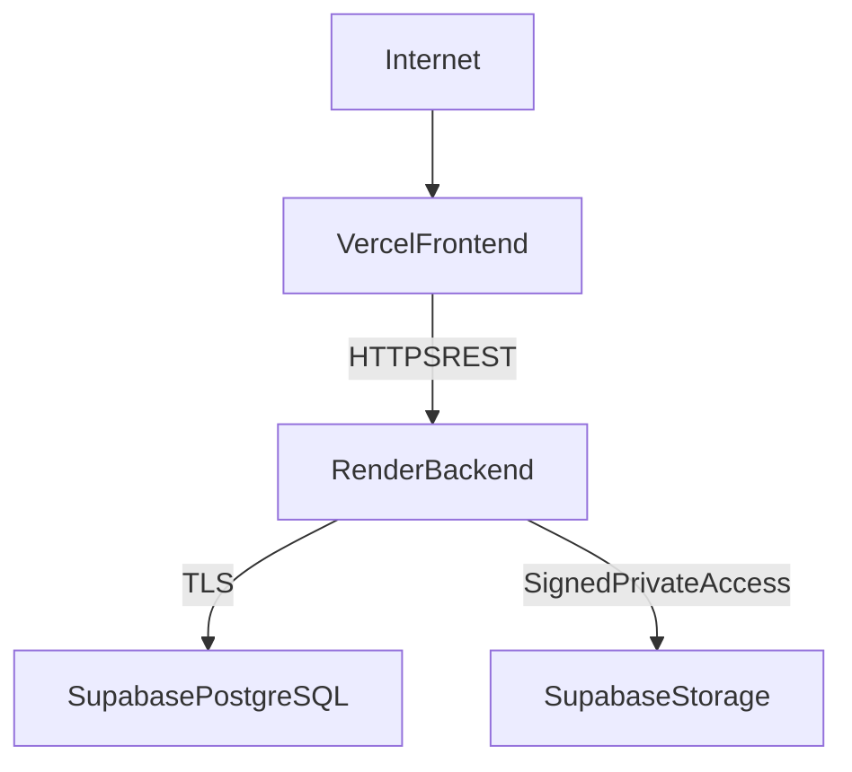

# Deployment Architecture

Status: Approved target; nothing is deployed yet

## Production topology

Platform-provided URLs are sufficient. A paid custom domain is not required.

## Environment separation

- Local development uses local PostgreSQL and a dedicated non-production storage bucket.
- Automated tests use an isolated PostgreSQL database and isolated/test-double external
  resources.
- Production uses separate Render, Supabase, and Vercel configuration.
- Production data or credentials must never be reused in development or tests.

## Configuration contract

Expected frontend configuration includes:

- `VITE_API_URL`

Expected backend configuration will include:

- `NODE_ENV`
- `PORT`
- `DATABASE_URL`
- `DIRECT_URL` when required for controlled migrations
- `JWT_ACCESS_SECRET` or an asymmetric signing-key equivalent
- `JWT_ISSUER`
- `JWT_AUDIENCE`
- `ACCESS_TOKEN_TTL`
- `REFRESH_TOKEN_TTL`
- `SESSION_IDLE_TTL`
- `ALLOWED_ORIGINS`
- `HOSPITAL_TIME_ZONE`
- `DEFAULT_CURRENCY`
- `SUPABASE_URL`
- `SUPABASE_SERVICE_ROLE_KEY`
- `SUPABASE_DOCUMENT_BUCKET`

Names may be refined during initialization. Real values are provider secrets; only
variable names and safe examples belong in `.env.example`.

## Release process

1. Run lint, type checks, tests, frontend build, and backend build.
2. Review pending Prisma migrations and take the backup required by the runbook.
3. Apply committed migrations as a controlled release step.
4. Deploy the backward-compatible backend.
5. Deploy the frontend.
6. Verify health, authentication, CORS, database/storage connectivity, and critical
   workflows.
7. Record release and rollback information.

Application startup must not run `prisma db push` or silently alter production schema.

## CORS, cookies, and HTTPS

- Allow only known Vercel preview/production origins according to environment policy.
- Enable credentials only where the refresh flow requires them.
- Refresh cookies use `Secure`, `HttpOnly`, an intentional `SameSite` setting, narrow
  path/scope, and CSRF defenses.
- Test browser behavior on the actual Vercel and Render URLs early.
- Evaluate a same-origin Vercel proxy only if direct cross-site refresh cookies are
  unreliable; document any topology change.
- All production traffic uses HTTPS.

## Database connectivity

- Use the Supabase connection method appropriate for long-running Render processes and
  controlled Prisma migrations.
- Keep runtime pooling and direct migration URLs distinct if Supabase requires it.
- Set conservative connection limits to avoid exhausting provider quotas.
- Use least-privilege runtime credentials when provider capabilities permit.

## Backup and recovery

The PDF requires daily backups, weekly full backups, recovery support, and high
availability. These remain unverified until provider-plan capabilities and operating
procedures meet them.

Deployment preparation must document:

- provider backup frequency, retention, encryption, and restore scope;
- an independent logical export schedule if needed;
- who initiates and verifies backups;
- restore steps into a safe non-production target;
- recovery point and recovery time objectives;
- evidence from periodic restore tests;
- limitations of the selected free tiers.

Do not claim high availability merely because managed services are used.

## Document storage operations

- Store objects in a private bucket, separated by environment.
- Back up metadata and define whether/how object versions are retained.
- Reconcile failed staged uploads and orphaned objects.
- Document deletion/retention behavior before accepting real data.
- Render's ephemeral filesystem may be used only for bounded temporary processing and
  must not be the document system of record.

## Production verification

- Login, refresh, expiry, logout, and unauthorized access.
- Frontend-to-backend API connectivity and CORS.
- Backend-to-database and backend-to-storage connectivity.
- Patient registration/search, appointment flow, and authorized clinical access.
- Lab, pharmacy, and billing transaction paths when implemented.
- Dashboard values from real persisted data.
- Safe production error responses and absence of sensitive logs.
- Backup status and documented restore test.

## Known platform risks

- Render free-tier cold starts can make first requests slow.
- Free-tier quotas can limit database connections, storage, and availability.
- Cross-site cookies may be restricted by browser privacy behavior.
- Preview deployments require an explicit CORS policy.
- Provider products and limits change; verify current documentation during deployment
  rather than relying on this design as a live service guarantee.
