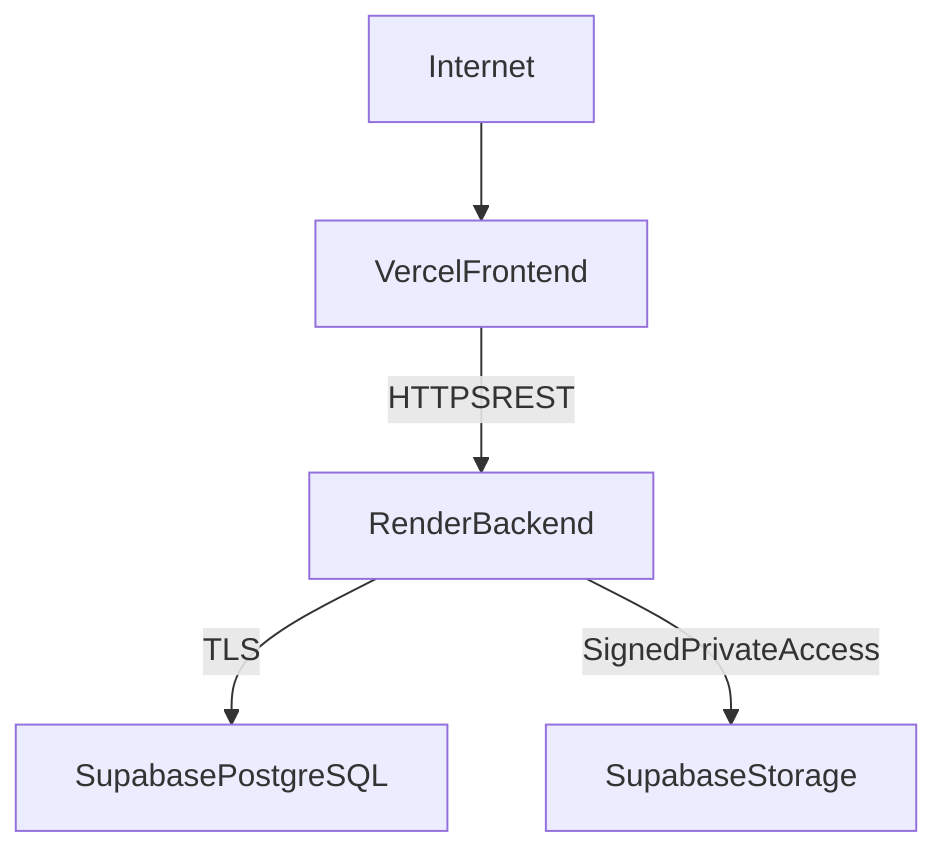

# Deployment Architecture

Status: Approved operating policy (D-034). This document describes how to deploy the
implemented HMS to Vercel, Render, and Supabase PostgreSQL. Backup, restore, and
high-availability evidence remain D-035 and are not provided here.

## Current demo environment

Recorded during M17 preparation. Secrets are not stored in Git.

| Resource | Value |
| --- | --- |
| Supabase project | `hms-demo` |
| Project ref | `cvydppurlwdjgzzlzbie` |
| Region | `ap-south-1` |
| API URL | `https://cvydppurlwdjgzzlzbie.supabase.co` |
| Document bucket | `hms-patient-documents` (private, 10 MB, PDF/JPEG/PNG) |
| Committed Prisma migrations | Applied to this database; `_prisma_migrations` has four rows |
| Vercel production URL | Not live yet |
| Render API URL | Not live yet |

The database password, JWT secret, and Storage Secret API key belong only in the
provider dashboards. After those values exist, run `npm run prisma:migrate:deploy`
against production `DIRECT_URL` to confirm Prisma agrees the history is applied.

## Production topology


```mermaid
flowchart TD
  Internet[Internet] --> Vercel[VercelFrontend]
  Vercel -->|HTTPSREST| Render[RenderBackend]
  Render -->|TLS| SupabaseDB[SupabasePostgreSQL]
  Render -->|SignedPrivateAccess| SupabaseStorage[SupabaseStorage]
```

The application remains a modular monolith. The browser talks only to the versioned
REST API. Prisma is the only database access path. Patient documents use private
Supabase Storage through the backend.

Platform-provided HTTPS URLs are sufficient. A paid custom domain is not required.

Chosen cookie topology (D-034 option 1): direct Vercel-to-Render credentialed requests
with production `Secure; HttpOnly; SameSite=None` refresh cookies. A same-origin Vercel
API proxy is the documented fallback only if browser third-party cookie restrictions
make refresh fail on the real URLs.

## Environment separation

- Local development uses local PostgreSQL and may use `DOCUMENT_STORAGE_DRIVER=memory`
  or a dedicated non-production storage bucket.
- Automated tests use isolated local PostgreSQL (`hms_test`) and the in-memory storage
  double.
- Production uses separate Render, Supabase, and Vercel configuration.
- Production data or credentials must never be reused in development or tests.
- Demo data must be fictional. Do not load real patient, clinical, or password data.

## Configuration contract

Frontend (Vite, baked at build time):

- `VITE_API_URL` — versioned backend base URL, for example
  `https://<render-service>.onrender.com/api/v1`

Backend (Render environment variables):

- `NODE_ENV` — `production`
- `PORT` — provided by Render; do not hardcode
- `DATABASE_URL` — runtime PostgreSQL URI (pooled)
- `DIRECT_URL` — Prisma migration URI; required by the schema, not read by Express
- `JWT_ACCESS_SECRET` — high-entropy secret, at least 32 characters
- `JWT_ISSUER` — `hms-api`
- `JWT_AUDIENCE` — `hms-web`
- `ALLOWED_ORIGINS` — comma-separated exact origins: the Vercel production origin and
  approved local development origins such as `http://localhost:5173`
- `AUTH_COOKIE_NAME` — `hms_refresh`
- `AUTH_COOKIE_DOMAIN` — omit for a host-only cookie on the Render API host
- `TRUST_PROXY` — `true` on Render
- `HOSPITAL_TIMEZONE` — IANA zone, for example `Asia/Colombo`
- `DEFAULT_CURRENCY` — ISO 4217 code, for example `LKR`
- `LOG_LEVEL` — `info` in production
- `SUPABASE_URL`
- `SUPABASE_SECRET_KEY` — backend only
- `SUPABASE_STORAGE_BUCKET`
- `DOCUMENT_SIGNED_URL_TTL_SECONDS` — default `300`
- `DOCUMENT_STORAGE_DRIVER` — `supabase` in production; `memory` is rejected

Do not commit real values. Example files contain placeholders only.

Authentication lifetimes remain code invariants: 15-minute access JWT, 30-minute refresh
idle timeout, seven-day absolute refresh lifetime.

## 1. Supabase project and database

1. Create a dedicated Supabase project for this environment. Do not share it with local
   development.
2. Copy the database connection URIs from the Supabase dashboard.
3. Set `DATABASE_URL` to the pooled runtime URI appropriate for a long-running Node
   process. Append a conservative `connection_limit` if the provider dashboard shows a
   small connection quota.
4. Set `DIRECT_URL` to the URI Prisma should use for `migrate deploy`. If the pooled
   transaction-mode URI cannot run migrations, use the session-mode or direct URI that
   the current Supabase dashboard documents for Prisma.
5. If Render can reach IPv4 only, use the connection method the current Supabase
   dashboard marks as IPv4-compatible. Do not assume a free-tier direct host is
   reachable from every provider.
6. Create a private Storage bucket named to match `SUPABASE_STORAGE_BUCKET`. Public
   access must stay disabled. Do not create public object URLs.
7. Keep the Secret API key (`SUPABASE_SECRET_KEY`) on the backend only. Never put it
   in Vercel or the frontend bundle.
8. HMS talks to PostgreSQL only through Prisma. In the Supabase API settings, disable
   the Data API / PostgREST for this project so the anon key cannot reach public tables.
   Do not treat the frontend publishable key as a data-access credential.

## 2. Prisma production migrations

Production schema deployment uses only:

```sh
npm run prisma:migrate:deploy
```

Do not use `prisma db push`. Do not use `prisma migrate dev` against production. The
API process does not migrate or mutate schema at startup.

Apply migrations as a controlled release step against `DIRECT_URL` after reviewing the
committed SQL in `backend/prisma/migrations/`. Then start or restart the already-built
API so it connects to the migrated database.

Local database tests also call `prisma migrate deploy` against isolated `hms_test` and
are not a production migrate.

## 3. Render backend

Repository root is the Render service root. `render.yaml` records the build, start, and
non-secret environment names.

1. Create a Node web service from this repository.
2. Build command: `npm ci --include=dev && npm run prisma:generate -w backend && npm run build -w backend`
3. Start command: `npm run start -w backend`
4. Health check path: `/api/v1/health`
5. Use Node 22 (`NODE_VERSION=22` or `.nvmrc`).
6. Set every backend variable listed above. `PORT` is injected by Render.
7. Set `ALLOWED_ORIGINS` to the exact Vercel origin plus `http://localhost:5173`.
8. Apply pending Prisma migrations with `DIRECT_URL` before expecting the API to serve
   application traffic.
9. Bootstrap the first administrator with the existing
   `npm run bootstrap:admin -w backend` command, using a fictional username and a
   one-time password that meets the application policy. Remove bootstrap variables
   immediately afterwards.

The compiled process listens on `0.0.0.0` and the provider `PORT`. Startup connects to
PostgreSQL through Prisma and does not change schema. SIGINT/SIGTERM still close the
HTTP server and disconnect Prisma.

Verify after deploy:

- `GET /api/v1/health` returns `{ "status": "ok", "service": "hms-api", "timestamp": ... }`
  with no database credentials or schema details
- `GET /api/docs` serves Swagger UI
- `GET /api/v1/openapi.json` returns the implemented specification
- API errors remain `{ error: { code, message, requestId } }` without stack traces

## 4. Vercel frontend

Repository root is the Vercel project root. `vercel.json` installs the workspace,
builds the frontend package, publishes `frontend/dist`, and rewrites unknown paths to
`index.html` so client-side routes survive refresh.

1. Import the Git repository into Vercel without setting a subdirectory root.
2. Set `VITE_API_URL` to the Render API origin plus `/api/v1` for Production (and
   Preview only if that preview is also in `ALLOWED_ORIGINS`).
3. Deploy. Confirm the production JavaScript bundle contains the Render API URL and
   does not contain `http://localhost:5000`.
4. Confirm a direct refresh of a nested route such as `/patients` serves the SPA
   instead of a Vercel 404.

Do not put secrets in `VITE_*` variables. `VITE_API_URL` is a public API origin.

## 5. CORS

`ALLOWED_ORIGINS` is an exact allowlist. Wildcard, `*`, and reflected origins are
rejected by configuration parsing.

Production must include:

1. The deployed Vercel origin, for example `https://<project>.vercel.app`
2. Approved local development origins, at least `http://localhost:5173`

Credentialed CORS remains enabled because the refresh cookie is cross-site. Cookie
authentication POSTs still require `Origin` in that allowlist and `X-HMS-CSRF: 1`.

## 6. Production cookies

On `NODE_ENV=production` the refresh cookie is:

- `HttpOnly`
- `Secure`
- `SameSite=None`
- `Path=/api/v1/auth`
- host-only unless `AUTH_COOKIE_DOMAIN` is set
- `Max-Age` equal to the seven-day absolute refresh lifetime

Access tokens remain in frontend memory. Logout clears the cookie and revokes the
server-side refresh session. Do not move access tokens into `localStorage` or
`sessionStorage`.

If a browser blocks the third-party refresh cookie, record the failure and evaluate
the already-approved same-origin Vercel proxy fallback. Do not weaken cookie flags to
make deployment appear to work.

## 7. Supabase Storage

Production must set `DOCUMENT_STORAGE_DRIVER=supabase`. Memory storage cannot start in
production.

- The bucket is private.
- The backend authorizes upload, metadata, download, and delete.
- Download uses short-lived signed URLs (30–900 seconds; default 300).
- Object keys remain random `patient-documents/<uuid>` values.
- File metadata remains in PostgreSQL.
- MIME, magic-byte, and 10 MB size validation remain server-side.
- Malware scanning remains deferred (D-030). Do not treat the demo as scanned storage.

## 8. Health and OpenAPI

`GET /api/v1/health` is process liveness only. It does not return database host, schema,
or credential information. Database connectivity is verified at process startup through
Prisma `$connect`. Do not add extra health routes only for a vendor dashboard.

`/api/docs` and `/api/v1/openapi.json` remain available on the deployed API.

## 9. Demo data

Use fictional identities, addresses, and clinical text. Do not upload real patient
files. The existing bootstrap-admin command is the only identity seed. Do not introduce
a second seed framework unless an operator later needs one.

## 10. Verification

After each environment is configured, verify:

- login, refresh, logout, invalid credentials, disabled account, protected routes
- patient list/search/create/update
- appointment create/view/cancel or reschedule according to existing permissions, plus
  calendar
- medical record and prescription workflows
- laboratory request, sample collection, and result entry
- medicine catalogue, stock, and dispensing
- invoice issue, payment, and linked reversal where permitted
- attendance, leave, patient documents, user administration, audit viewer
- dashboard and reports
- desktop, tablet, and mobile layout of login, shell, tables, forms, and dialogs

Do not claim a workflow passed unless it was actually exercised on the deployed URLs.

## 11. Rollback and redeployment

- Frontend rollback: redeploy a previous Vercel production deployment of `frontend/dist`.
- Backend rollback: redeploy a previous Render build of the compiled API. The process
  still requires a database schema compatible with that build.
- Schema rollback is not automatic. Prisma `migrate deploy` only applies forward
  committed migrations. Reverting schema requires a new reviewed migration or a restore
  that is out of scope for D-035.
- Changing `VITE_API_URL` requires a frontend rebuild. Changing Render env vars
  requires a service restart.
- Keep D-035 backup/restore evidence separate; this runbook does not claim provider
  backup retention or RPO/RTO.

## Release process

1. Run lint, type checks, tests, frontend build, and backend build.
2. Review pending Prisma migrations.
3. Apply committed migrations with `prisma migrate deploy` against production
   `DIRECT_URL`.
4. Deploy the backend to Render.
5. Deploy the frontend to Vercel with the production `VITE_API_URL`.
6. Verify health, authentication, CORS, cookies, database/storage connectivity, and
   critical workflows.
7. Record the actual URLs and any failed checks honestly.

Application startup must not run `prisma db push` or silently alter production schema.

## CORS, cookies, and HTTPS

- Allow only known exact origins.
- Enable credentials because refresh uses a cross-site cookie.
- All production traffic uses HTTPS provided by Vercel, Render, and Supabase.

## Database connectivity

- Keep runtime pooling (`DATABASE_URL`) and migration (`DIRECT_URL`) distinct when
  Supabase requires it.
- Set conservative connection limits to avoid exhausting the current plan quota.
- Use least-privilege runtime credentials when the provider dashboard permits.

## Backup and recovery

The PDF requires daily backups, weekly full backups, recovery support, and high
availability. Those remain unverified until D-035. Do not claim high availability
because managed services are used.

## Known platform risks

- Render cold starts can make the first request slow.
- Provider quotas can limit database connections, storage, and availability.
- Cross-site cookies may be restricted by browser privacy behavior.
- Preview deployments need an explicit CORS origin if they are used.
- Provider products and limits change; verify the current dashboards during deployment.
