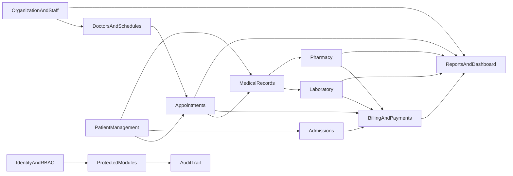

# Requirements Analysis

Status: Approved baseline  
Primary source: `Hospital_system.pdf`

## Requirement classification

This document uses three classifications:

- **PDF requirement** — explicitly required by the software specification.
- **Engineering decision** — selected to implement the requirements safely and
  maintainably; it is not represented as wording from the PDF.
- **Future enhancement** — explicitly deferred and not part of current functionality.

The PDF lists cloud deployment as a future enhancement. The project brief explicitly
promotes Vercel, Render, and Supabase deployment into current scope, so that later
instruction governs this project.

## Functional requirements

### User management

- Login and logout.
- Password management.
- User roles and access control.
- Users include administrator, doctor, nurse, receptionist, laboratory staff,
  pharmacist, and accountant.

### Patient management

- Register a patient.
- Update patient information.
- Search for patients.
- View medical history.
- Upload patient documents.

### Doctor and department management

- Add and update doctors.
- Assign doctors to departments.
- Manage doctor schedules.

### Appointment management

- Book, cancel, and reschedule appointments.
- Track appointment status.
- Select a doctor.
- Provide a calendar-oriented appointment interface.

### Electronic medical records

- Record diagnoses.
- Record prescriptions.
- Maintain treatment history.
- Produce medical reports.

### Laboratory management

- Create test requests.
- Record sample collection.
- Enter results.
- Generate laboratory reports.

### Pharmacy management

- Maintain medicine inventory.
- Process prescriptions.
- Manage stock.
- Monitor medicine expiry.

### Billing and payments

- Record consultation, laboratory, pharmacy, and admission charges.
- Generate invoices.
- Record payments.
- Generate printable receipts as required by the billing UI specification.

### Inpatient and outpatient management

Inpatient and outpatient management is named in scope. The PDF identifies an
`Admissions` database area and admission charges, but does not define bed, ward,
transfer, discharge, or outpatient workflows. The approved baseline therefore treats:

- outpatient care as appointments plus medical records; and
- inpatient care as a minimal admission record and lifecycle.

Bed and ward management is not current scope unless a later approved requirement adds
it.

### Staff management

- Register employees.
- Record attendance.
- Assign departments.
- Maintain leave records.

### Reports and dashboard

- Patient reports.
- Appointment reports.
- Revenue reports.
- Pharmacy reports.
- Laboratory reports.
- Staff reports.
- Dashboard values for total patients, today's appointments, revenue summary,
  laboratory requests, and pharmacy alerts.

Dashboard and report values must come from persisted data and must not be hardcoded.

### Required UI capabilities

- Login screen with username, password, and login action.
- Patient screen for adding, editing, searching, and viewing history.
- Appointment screen for scheduling, calendar display, and doctor selection.
- Billing screen for bill generation, payment receipt, and receipt printing.

## Non-functional requirements

### Performance

- Support multiple concurrent users.
- Provide fast responses.
- Optimize database performance.

The PDF provides no measurable load or latency target. Performance acceptance criteria
must be established before a production-readiness claim can be made.

### Security

- Secure login.
- Password protection. Although the PDF says “encryption,” passwords will be protected
  with one-way password hashing.
- Role-based access control.
- Audit logs.
- Automatic session timeout.

The project brief additionally requires API-boundary validation, server-side
authorization, safe uploads, secret management, safe error responses, and protection of
sensitive patient information.

### Reliability and recovery

- Daily database backups.
- Weekly full backups.
- High availability.
- Data recovery support.
- A disaster recovery plan and audit trail.

These are target requirements, not current implementation claims. Free hosting tiers may
not provide the required backup retention or high availability; provider capabilities
and restore tests must be documented before marking them complete.

### Usability and compatibility

- User-friendly, responsive interface with easy navigation.
- Support current Chrome, Edge, and Firefox on Windows 10/11 clients.
- Use consistent validation, loading, error, empty, and notification states.

## Proposed least-privilege role matrix

The PDF names roles but does not allocate permissions. This approved baseline remains
subject to resource-level rules in each workflow.

### Administrator

- Manage users, roles, employees, doctors, departments, and schedules.
- View system reports and audit records.
- Does not receive clinical editing authority solely from being an administrator.

### Doctor

- View relevant patients and assigned appointments.
- Create diagnoses, treatments, prescriptions, medical reports, and lab requests.
- Manage their own schedule within hospital policy.

### Nurse

- View relevant patient, admission, and prescribed-treatment information.
- Record permitted care observations and assist with approved sample/status workflows.
- Cannot diagnose or prescribe by default.

### Receptionist

- Register and update patient demographic information.
- Search for patients and manage appointments.
- Register admissions.
- Cannot edit clinical records or administer finances.

### Laboratory staff

- View assigned laboratory requests.
- Record sample collection and test results.
- Generate laboratory reports.
- Cannot change unrelated clinical, pharmacy, or billing data.

### Pharmacist

- View valid prescriptions needed for dispensing.
- Process dispensing.
- Manage medicines, batches, stock movements, and expiry alerts.

### Accountant

- Manage invoices, payments, receipts, charge review, and revenue reports.
- View only the patient identity and service information needed for billing.

### Enforcement rules

- Every protected operation is authorized by the backend.
- Frontend route and control visibility is a usability feature, not a security boundary.
- Permission checks are combined with resource-level access checks where required.
- Users may hold more than one role, but permissions remain explicit and auditable.

## Module boundaries and dependencies

- Identity and access is required by every protected module.
- Organization and staff supplies departments, employees, and doctor identities.
- Patient management supplies the patient identity used by all care and finance modules.
- Doctor scheduling and patient management feed appointments.
- Appointments and admissions provide care context for medical records.
- Medical records produce prescriptions and laboratory requests.
- Pharmacy consumes prescriptions and creates inventory movements and billable charges.
- Laboratory consumes requests and creates results and billable charges.
- Billing aggregates valid consultation, laboratory, pharmacy, and admission charges.
- Reports and dashboards query persisted operational data without owning it.
- Audit captures security-sensitive and material clinical/financial actions.

## Explicitly deferred future enhancements

- Mobile application.
- Patient portal.
- SMS and email notifications.
- Telemedicine.
- Insurance integration.
- AI-based decision support.
- Biometric authentication.

None of these should appear as implemented, and they should not drive current schema or
API expansion without an approved change.

## Traceability and acceptance

Each implemented use case must reference one of the functional areas above. OpenAPI,
tests, and user documentation must describe only behavior that exists. Any new major
requirement must be recorded in the decision register before it changes architecture or
data design.
